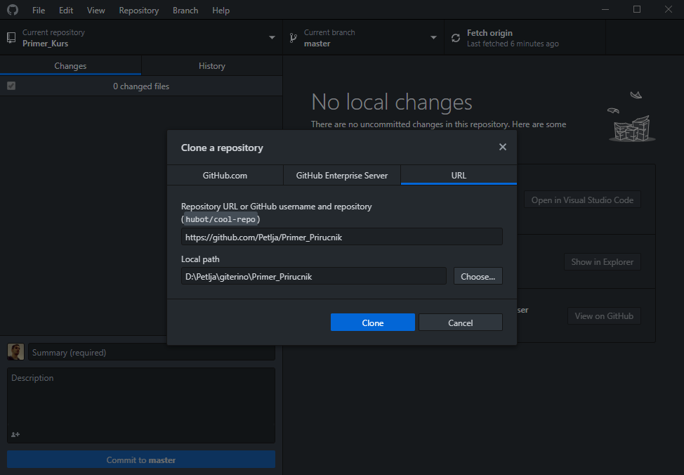
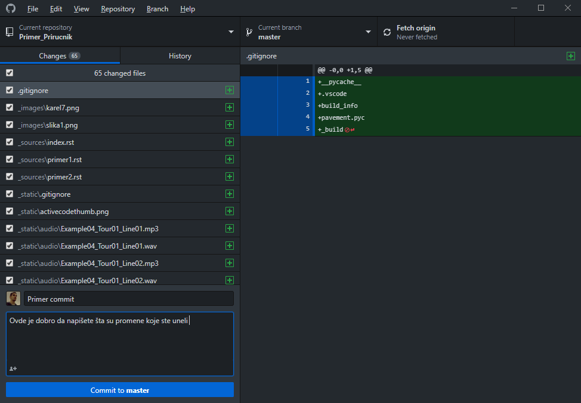

==================
Коришћење Github-a
==================

Да бисте почели са радом на материјалима, мораћете прво да преузмете започете репозиторијуме са Петљиног ``GitHub-a``. Да бисте то урадили, потребно је да одете на одговарајући репозиторијум улоговани на свој налог и ту кликнете на дугме ``Clone or downlaod`` које се налази са десне стране и затим кликнете на ``Open in Desktop``. 

.. image:: ../_images/git1.png
   :width: 800px   
   :align: center 

Ово ће отворити GitHub Desktop на вашем рачунару у коме ће отворити прозор у коме је потребно да изабере где на свој рачунар желите да сместите фолдер пројекта. Одаберите жељену локацију и кликните на ``Clone``. Ово ће клонирати репозиторијум на ваш рачунар.

Ово практично значи да ћете имати локалну верзију репозиторијума који постоји на Петљином Github-у. Ту локалну верзију можете мењати како год пожелите, она ће се понашати као било који други фолдер на вашем рачунару. Све промене које унесете биће видљиве само вама докле год не пошаљете на  верзију пројекта која постоји онлајн. 

Да бисте то урадили, потребно је да урадите следећу ствар. Након што сте унели промене, отворите Github Desktop. У горњем левом углу видећете у ком се репозиторијуму налазите (увек прво обратите пажњу да ли се оно што радите односи на жељени репозиторијум). Испод тога излистане су промене које сте унели и које можете да бирате да ли желите да укључите или не. У поље испод тога морате комиту који правите дати неки назив и, опционо, можете унети опис промена које сте унели. Када сте задовољни тиме кликните на дугме ``Commit to master`` које се налази у доњем левом углу. Када сте то завршили, промене које сте унели спремне су за слање. У горњем левом углу кликните на дугме ``Push`` (раније је ту стајало ``Fetch origin``) и то ће ваше промене послати на онлајн верзију пројекта и тада ће и сарадници моћи да им приступе. 

Рад са GitHub-ом може бити и доста компликованији од овога (што се више људи укључи у пројекат ствари могу бити компликованије) тако да вам препоручујемо да полгедате `ову страницу <https://petlja.org/net.kabinet>`__ како бисте могли даље да напредујете.

Још један користан савет био би да често комитујете и пушујете промене које сте направили (да не нагомилавате промене у локалној верзији) зато што то може да доведе до проблема са усаглашавањем верзија када више људи ради на истом пројекту. Такође, сваки пут када започнете са радом у идеалном случају бисте онлајн верзију ажурирали свим променама које сте направили и могли бисте да повучете промене осталих колега тако што ћете кликнути на дугме ``Fetch origin`` и затим на дугме ``Git pull``, што ће вашу локалну верзију ажурирати променама које постоје у онлајн верзији. 