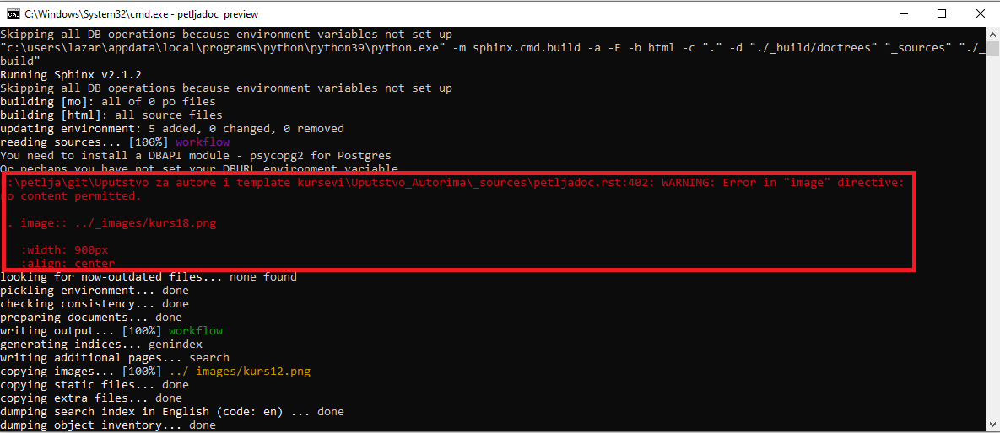
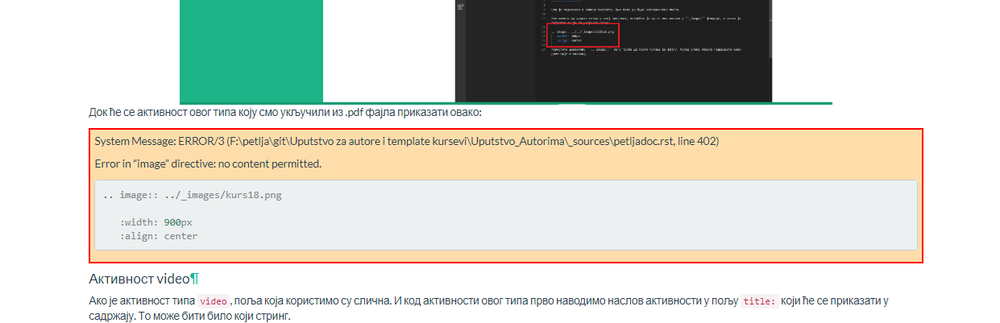

Грешке
=======

Приликом рада, често ће се десити да негде погрешите, било да се ради о погрешном форматирању .yaml фајла приликом рада са курсевима, било да се ради о синтаксној грешци приликом писања reStructuredText кода, било да се ради о укључивању фајла који не постоји... Кад год се деси нешто што Петљадок препознаје као грешку, у оквиру командног прозора у коме сте покренули ``petljadoc preview`` команду, црвеним словима исписаће се порука о грешци и та порука изгледаће као на следећој слици:

У оквиру те поруке, која год да је грешка направљена, писаће у ком фајлу је грешка настала и на којој линији кода у оквиру тог фајла се грешка појавила. Такође, у оквиру поруке биће назначено и шта није у реду са кодом, то јест због чега Петљадок није успео да на одговарајућ начин избилдује ваш пројекат. У овом конкретном случају, видимо да у фајлу ``petladoc.rst`` који се налази унутар фолдера ``_sources`` у оквиру нашег пројекта, на линији 402 на погрешан начин форматирана директива за укључивање слике. 

Такође, када бисмо погледали како у браузеру изгледа фајл који је избилдован уз грешку, видећемо да се на месту где треба да се појави слика такође појављује иста порука о грешци

У овом примеру проблем је у томе што имамо празан ред вишка између реда у коме се налази директива ``.. image::`` и њених опција ``:width:`` и ``:align:``. Грешку отклањамо брисањем тог реда и наш материјал ће се, након што запамтимо промене, у браузеру приказати без упозорења о грешци. 

.. infonote:: Важно

   Ако током рада приметите да се у браузеру приказују грешке на одређеним местима у материјалу на коме радите, **НЕМОЈТЕ ИХ ИГНОРИСАТИ** већ покушајте да их исправите или контактирајте неког из тима Петље да вам помогне у исправљању грешака. **ВАШ МАТЕРИЈАЛ НЕЋЕ МОЋИ ДА СЕ ОБЈАВИ АКО ИМА БИЛО КАКВИХ УПОЗОРЕЊА О ГРЕШКАМА**

Честе грешке
::::::::::::

Сада ћемо показати неке најчешће грешке и објаснићемо на шта да обратите пажњу при њиховом отклањању.

Наслов је погрешно форматиран - ``title underline too short``
--------------------------------------------------------------

Ова грешка се најчешће јавља када се приликом наслова употреби мањи број карактера за подвлачење него број карактера у наслову. Порука о грешци ће изгледати овако у командном прозору:

.. image:: ../_images/greska3.png
   :width: 900px   
   :align: center 

Док ће грешка у браузеру изгледати овако:

Код који је грешку произвео изгледа овако:

Грешка се отклања тако што се подвлачење продужи тако да број карактера које користимо за подвлачење у наслову буде једнак броју карактера из наслова.

Слика не постоји - ``image file not readable``
----------------------------------------------

Ова грешка јавља се када покушамо да укључимо слику коју Петљадок није могао да укључи у пројекат. Најчешће појављивање ове грешке дешава се зато што слика коју покушавамо да укључимо не постоји или зато што смо погрешно откуцали име слике. Грешка у командном прозору изгледа овако:

.. image:: ../_images/greska6.png
   :width: 900px   
   :align: center 

У браузеру неће бити исписана порука о грешци, али на месту где је требало да се појави слика стајаће само линк и иконица за слику уместо изрендероване слике:

.. image:: ../_images/greska7.png
   :width: 900px   
   :align: center 

Да бисте грешку отклонили најчешће ће бити довољно да проверите да ли фајл који желите да укључите стварно постоји у фолдеру ``_images`` или да ли сте добро откуцали име фајла који желите да укључите.

Фајл није укључен у садржај- ``document isn't included in any toctree``
-------------------------------------------------------------------------

Ова грешка јавља се зато што у фолдеру ``_sources`` или његовим потфолдерима имамо .rst фајл који није укључен ни у једну директиву ``.. toc::`` (ни у један садржај) у оквиру материјалa који пишемо и упозорава нас да том фајлу неће моћи да се приступи кроз линкове у садржају.

.. image:: ../_images/greska8.png
   :width: 900px   
   :align: center 

Ако погледамо садржај нашег ``_sources`` фолдера, видимо да постоји фајл *github.rst*:

И он није укључен ни у један садржај у оквиру нашег пројекта. Ова грешка се отклања тако што све фајлове који се појављују у нашем пројекту укључимо у барем један садржај у оквиру пројекта. 

Директива није добила очекивани аргумент
----------------------------------------

Ова порука о грешци сугерише да је нека директива очекивала да добије аргумент, али га није добила. Испод видимо пример ``.. image::`` директиве која као аргумент није добила путању ка фајлу са сликом, коју очекује. 

.. image:: ../_images/greska10.png
   :width: 900px   
   :align: center 

У браузеру ће се приказати грешка на следећи начин: 

Грешку отклањамо тако што директиву форматирамо на подразумеван начин. За правилно форматирање директива погледајте `демо курс <https://petlja.github.io/demo_kurs/02_basics/02_directives.html#id37>`__.

Неочекивано увлачење - ``unexpected indentation``
-------------------------------------------------

Ова грешка појављује се када Петљадок наиђе на увучени ред на месту где нема смисла да се увлачење појави. Како је у restructuredText
назубљивање јако важно, када се појави неочекивано увучен ред, Петљадок пријављује грешку. Та грешка изгледа овако:

.. image:: ../_images/greska12.png
   :width: 900px   
   :align: center

У браузеру ће се та грешка овако приказати:

.. image:: ../_images/greska13.png
   :width: 900px   
   :align: center

А изворни код који је ову грешку произвео изгледа овако:

.. image:: ../_images/greska14.png
   :width: 900px   
   :align: center

Видимо да у овом случају између директиве ``.. image::`` и пасуса изнад не постоји празан ред. Због тога Петљадок први ред директиве **.. image:: ../_images/greska9.png** тумачи као да је део параграфа који се налази изнад и онда пријављује грешку када наиђе на увлачење у следећем реду. Ако одвојимо позив директиве од параграфа, Петљадок ће знати где се параграф завршава, а где почиње директива и препознаће због чега су наредна два реда увучена, па се грешка неће појавити. 

Како бисте избегли овакав проблем, увек обратите пажњу да пре и после директива и параграфа остављате празан ред.

Наравно, ова грешка ће се појавити сваки пут када се појави неочекивано увлачење тако да морате обратити пажњу на назубљивање у .rst фајловима. За правилно форматирање погледајте поглавље `Форматирање <https://petlja.github.io/demo_kurs/02_basics/01_formatting.html#id6>`__ Демо курса.

Незатворено обележавање текста - ``Inline ---- start-string without end-string``
---------------------------------------------------------------------------------

Овај тип грешке јавља се када у параграфу обележимо део текста посебним карактерима (за подебљавање, искошавање и сл.), али нигде не затворимо обележавање. Порука о грешци излгеда овако:

Изворни параграф изгледа овако: 

Можемо видети да смо употребили ** како бисмо подебљали део текста, али нигде нисмо ставили крај подебљавања. Због тога Петљадок не зна који део текста да подебља и две звездице не тумачи као означавање подебљавања, већ као обична два караткера. У браузеру овај параграф изгледа овако 

.. image:: ../_images/greska17.png
   :width: 900px   
   :align: center

За правилно форматирање погледајте поглавље `Форматирање <https://petlja.github.io/demo_kurs/02_basics/01_formatting.html#id6>`__ Демо курса.

Више пута је употребљен исти ИД 
---------------------------------

Када користимо директиве које као аргумент узимају јединствени стринг који служи као јединствени идентификатор на нивоу целог материјала, добићемо грешку ако покушамо да исти идентификатор употребимо више пута. Порука о грешци коју ћемо добити изгледа овако 

Док изворни код изгледа овако: 

.. image:: ../_images/greska19.png
   :width: 600px   
   :align: center

Видимо да смо једну за другом позвали две директиве за питање са истим идентификатором ``mchoice_sample_question1``. Због тога смо добили поруку о грешци, а у браузеру ће бити приказано само прво питање. 

.. image:: ../_images/greska20.png
   :width: 900px   
   :align: center

Грешке у форматирању .yaml фајла у курсевима
--------------------------------------------

Често се дешава да приликом израде курса погрешимо при форматирању .yaml фајла. Као што смо рекли у поглављу о курсевима где смо објаснили `форматирање овог фајла <Форматирање .yaml фајла>`_, .yaml се **МОРА** форматирати на објашњен начин како би пројекат уопште могао да се прикаже у браузеру. 

Грешке које се тичу форматирања овог фајла најчешће су везане за то да је неки обавезни елемент пропуштен, назубљивање није добро изведено или се два пута употребио исти guid. 

.. infonote:: 

   Најбољи савет овде би био да чим видите поруку о грешци која се тиче .yaml фајла одете на поглавље о `форматирању овог фајла <Форматирање .yaml фајла>`_ и линију свог .yaml-а у којој је пријављена грешка упоредите са примерима. 

Поруке о грешци могу изгледати различито. У следећем примеру смо из .yaml фајла изоставили обавезни атрибут који одређује кратак опис и добили смо следећу поруку:

Ако изоставимо неки други елемент, на пример категорију description добићемо овакву поруку:

.. image:: ../_images/greska22.png
   :width: 900px   
   :align: center

Важно је да увек проверимо наш .yaml фајл, упоредимо га са примерима и видимо због чега је Петљадок пријавио грешку у тој линији фајла. 

Често ће се десити да са погрешно форматираним .yaml-ом Пељадок неће ни моћи да прикаже пројекат у браузеру. Међутим, дешаваће се да у током рада, док се пројекат већ приказује у браузеру, промени нешто у .yaml-у, на пример док смо додавали нову лекцију, и да при томе настане грешка. У том случају у самом браузеру добићемо поруку о грешци која изгледа овако: 

Ова конкретна грешка настала је зато што у коду, у линији 33, ``activities:`` нисмо поравнали са ``folder``, па је Петљадок пријавио грешку.

.. image:: ../_images/greska24.png
   :width: 400px   
   :align: center

Дупликат guid у .yaml фајлу
---------------------------

Још један чест тип грешке у .yaml-у дешава се када се два пута појави исти guid код различитих елемеанта у .yaml-а. Пошто guid треба да буде јединствени идентификатор, ако два пута употребимо исти, Петљадок ће пријавити грешку. 

Ако се ова грешка деси у току приказивања пројекта у браузеру, порука о грешци изгледаће овако:

.. image:: ../_images/greska25.png
   :width: 900px   
   :align: center

Ако је грешка направљена пре него што смо покренули команду ``petljadoc preview``, пројекат неће моћи да се уопште прикаже у браузеру. 

Довољно је да један од та два guida замените новим guid-ом и грешка ће бити отклоњена. 

Корисни линкови
:::::::::::::::

* Демо курс као помоћ за форматирање фајлова - https://petlja.github.io/demo_kurs/
* Поглавље `restructuredText <https://www.sphinx-doc.org/en/master/usage/restructuredtext/index.html>`__ из документације Sphinx-а 
* `Runestone Author’s Guide <https://runestone.academy/runestone/static/authorguide/index.html>`__
* `PetljaDoc README <https://github.com/Petlja/PetljaDoc/blob/master/README.md>`__ 
