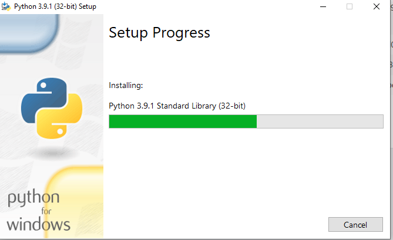
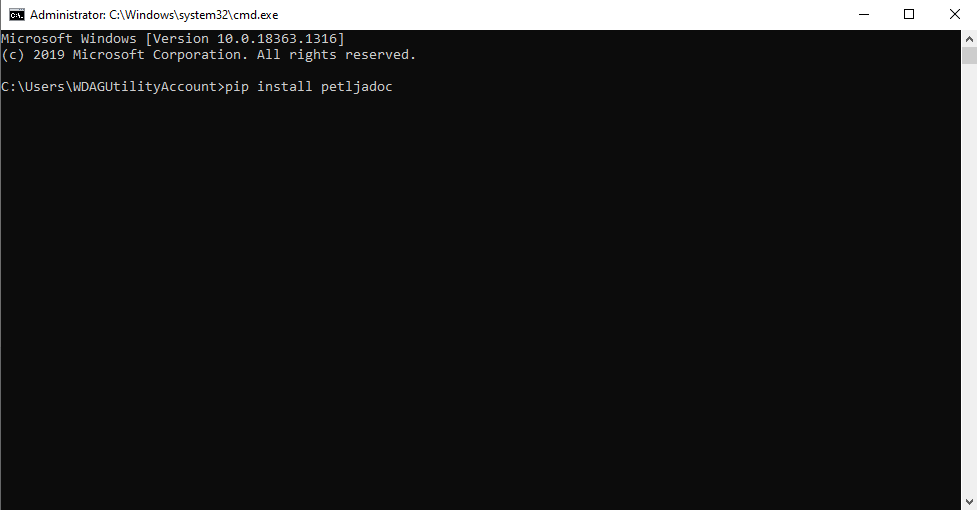

===========================
Инсталација потребних алата
===========================

У овом делу упутства биће објашњено како да инсталирате потребну верзију Пајтона и све пакете потребне за израду курсева и приручника. 

Инсталација Пајтона
:::::::::::::::::::

Да бисте користили ``Petljadoc`` (Петљадок), неопходно је да на свом рачунару имате инсталиран Пајтон, и то верзију која је новија од 3.6.х. У тренутку писања овог упутства, актуелна верзија Пајтона је 3.9.1 и она је компатибилна са свим алатима обухваћеним Петљадоком. Ову верзију можете преузети са следећег линка (за Windows оперативне системе) https://www.python.org/ftp/python/3.9.1/python-3.9.1.exe

.. reveal:: napomena_bojе
   :showtitle: Различите верзије Пајтона
   :hidetitle: Сакриј прозор
   
   .. infonote:: **Различите верзије Пајтона**
      
      Ако већ имате инсталирану ранију верзије Пајтона, важно је да она буде новија од верзије 3.6.х. Ако желите да на свом рачунару истовремено користите различите верзије Пајтона (задржите своју стару верзију и инсталирате нову), и то је могуће, али тај случај неће бити покривен овим упутством и то не препоручујемо осим ако нисте потпуно сигурни у своје знање и имате искуства са коришћењем више различитих верзија истовремено. 

Након што се завршило преузимање са инсталационог фајла са наведеног линка, покрените га како бисте започели са инсталацијом.

Обавезно обележите поље **Add Python 3.9 to PATH** и кликните на **Install Now**.

.. image:: ../_images/Python1.png
   :width: 600px   
   :align: center 

Пајтон ће започети инсталацију и, ако је све у реду то би требало да изгледа као на слици испод. 

Када се инсталација заврши требало би да добијете прозор као на слици испод. Можете кликнути на **Close** 

Инсталација Petljadoc
:::::::::::::::::::::

Када сте завршили са инсталацијом Пајтона, потребно је да инсталирате Петљадок. Петљадок представља пакет алата намењених изради интерактивних онлајн материјала за учење, налик на оне који се налазе на сајту `petlja.org <https:\\petlja.org>`__.  Неопходно је да током инсталације ових пакета имате приступ интернету. Да бисте инсталирали Петљадок, потребно је да прво отворите командни прозор, што ћете најлакше учинити ако истовремено притиснете **windows button + r**, у њега укуцате **CMD** и притиснете ентер. 

Ово ће отворити командни прозор и потребно је да у њему покренете следећу команду ``pip install petljadoc`` (ако ова команда не буде радила покушајте са ``py -3 -m pip install petljadoc``).

Ово ће покренути инсталацију која ће трајати неколико минута. Када је инсталација завршена, добићете поруку од система да је успешно инсталирано мноштво компоненти (као на слици испод). Слободно занемарите поруку о унапређењу верзије ``pip-a``.

Visual Studio Code
::::::::::::::::::

Пре него што почнете са радом, потребно је да инсталирате и неки текстуални едитор како бисте могли да израђујете и модификујете изворне фајлове у материјалима које правите. То може бити било који текстуални едитор (**Notepad++**, **Atom**, **Sublime Text**), али ми препоручујемо да то буде Visual Studio Code и примери у остатку овог упутства биће представљени у овом едитору. Да бисте га инсталирали, потребно је да одете на `овај линк <https://code.visualstudio.com/docs/?dv=win>`__ и преузимање инсталационог фајла требало би да почне аутоматски (ако преузимање не почне, можете одговарајућу верзију за ваш оперативни систем преузети `овде <https://code.visualstudio.com/download>`__). Када преузмете инсталациони фајл, отпочните инсталацију и само пратите инсталер (кораци су прилично самообјашњујући). Једино је потребно да обратите пажњу на четврти корак инсталације у коме је потребно да поља попуните као на слици испод. 

Након што инсталирате Visual Studio Code, покрените га и инсталирајте екстензију која се зове ``Insert GUID``. То ћете урадити тако што ћете са леве стране изабрати иконицу за екстензије (личи на тетрис), затим у поље за претраживање унети стринг ``Guid`` и онда пронаћи екстензију и кликнути на ``Install``. Ова екстензија биће вам потребна касније за рад са Петљадоком. 

Инсталација Git и Github Desktop
::::::::::::::::::::::::::::::::

На крају, да бисмо могли да усагласимо верзије пројеката на којима радите и сарађивали на њиховој изради, биће потребно да инсталирате и гит за Windows, а препоручујемо да уз њега инсталирате и Github Desktop. Како да користите ове алате објашњено је у `посебном одељку упутства <https://petlja.github.io/Uputstvo_Autorima/github.html>`__. За сада ће бити довољно да их инсталирате и да знате да они омогућују сарадњу на изради пројеката. 

Пре свега, идите на `github.com <https://github.com>`__ и тамо направите бесплатан налог. Након тога потребно је да инсталирате Git за Windows оперативни систем. То ћете урадити тако што ћете `овде <https://gitscm.com/download/win>`__ преузети инсталациони фајл (фајл би требало да се зове слично овоме *Git2.23.0-64-bit.exe*). Када се покрене инсталација, у инсталеру изаберите препоручене опције (оне ће већ бити обележене за вас) и завршите инсталацију. 

Након тога, потребно је да инсталирате и GitHub Desktop. То ћете урадити тако што ћете отићи на `овај линк <https://desktop.github.com/>`__ и преузети инсталациони фајл. Након тога, испратите инсталер и требало би да без проблема завршите инсталацију. 

Када сте и ово инсталирали спремни сте да почнете са радом. 