==================
Petljadoc употреба
==================

Шта је Petljadoc
::::::::::::::::

Петљадок представља низ алата који омогућују прављење интерактивних материјала за учење какве можете видети на сајту `petlja.org <https:\\petlja.org>`__. Ови материјали представљају курсеве и приручнике у које је могуће укључити Пајтон код тако да се извршава у браузеру, различите вежбе, интерактивна питања, слике, видео, звучне фајлове и сл.  

Петљадок у основи има `Runestone Interactive <https://github.com/RunestoneInteractive/RunestoneComponents>`__ и `Sphinx <https://github.com/sphinx-doc/sphinx>`__. Runestone користи ``restructuredText`` као језик за обележавање текста (markup language) у својим изворним фајловима. Изворни фајлови ових Runestone пројеката су у ``.rst`` формату и помоћу Петљадока их претварамо у ``.html`` фајлове које браузер може да приказује. 

.. infonote:: Ажурирање верзије Петљадока 

   Како је Петљадок алат који се стално развија, не заборавите да са времена на време унапредите верзију коју имате на свом рачунару. То можете урадити тако што ћете отворити командни прозор и покренути команду ``pip install petljadoc --upgrade`` што ће инсталирати нову верзију Петљадока. Пре него што покренете ову команду, неопходно је да већ имате инсталиран Петљадок на начин на који је објашњено `овде <instalacija_python.html>`__. 

У наредним поглављима објаснићемо како да радите са Петљадоком. Прво што треба да одлучите је да ли ће ваш материјал бити приручник или курс. Ако први пут радите са Петљадоком, највероватније ће вам чланови тима Фондације Петља рећи да ли је ваш материјал курс или приручник. 

Приручници
::::::::::

Примери приручника израђених на овај начин на Петљи, могу се наћи `овде <https://petlja.org/biblioteka/r/kursevi/prirucnik-python>`__ или `овде <https://petlja.org/biblioteka/r/kursevi/pygame-prirucnik>`__. У изради приручника помоћу Петљадока добићете сличан изглед материјала овим материјалима.

Започињање рада на приручнику
-----------------------------

.. infonote:: **Започет пројекат на Гитхабу**
      
   Врло је вероватно да ће приручник на коме је потребно да радите за вас већ бити започет и да ће бити довољно само да га преузмете са репозиторијума на Гитхабу. Ако је то случај, `овде <https://petlja.github.io/Uputstvo_Autorima/github.html>`__ можете видети како да преузмете одговарајући пројекат са Гитхаба. Након тога, слободно прескочите овај одељак и идите на следећи поднаслов, изглед пројекта.

Ако ипак сами започињете рад на новом приручнику мораћете сами да иницирате пројекат. Да бисте почели са радом на новом приручнику помоћу Петљадока потребно је да прво отворите нови фолдер где ће се приручник налазити. Затим је потребно да се у командној линији позиционирате у тај фолдер, што ћете најлакше урадити ако у Windows прозору тог фолдера у search bar укуцате ``cmd`` и притиснете ентер. 

.. image:: ../_images/Prirucnik1.png
   :width: 600px   
   :align: center 

То ће отворити командни прозор у коме је потребно покренути команду ``petljadoc init-runestone`` која ће направити костур пројекта у изабраном фолдеру. 

.. image:: ../_images/Prirucnik2.png
   :width: 600px   
   :align: center 

Када покренете ову команду потребно је да подесите још неколико параметара. Можете оставити предложене вредности (у угластим заградама) тако што ћете за сваки параметар притиснути ентер без уписивања било чега. Алтернативно, можете самостално подесити вредности ових параметара. На прво питање одговорите са ``y`` како бисте наставили даље. Потребно је да онда дате име пројекту, напишете име аутора, дате наслов који ће се појављивати у пројекту, изабрати програмски језик за примере кода који ће се извршавати у браузеру и на крају одабрати HTML тему целог пројекта (овде свакако оставите предложену вредност).

.. image:: ../_images/Prirucnik3.png
   :width: 600px   
   :align: center 

Изглед пројекта 
---------------

Пошто сте покренули ``petljadoc init-runestone`` и подесили све параметре, у фолдеру пројекта биће започет пројекат са приручником и фолдер пројекта требало би да вам изгледа као на слици испод: 

.. image:: ../_images/Prirucnik4.png
   :width: 600px   
   :align: center 

У основном директоријуму налази се неколико конфигурационих фајлова (``conf.py``, ``pavement.py``, ``conf-petljadoc.json``, ``.gitignore``) које у већини случајева није потребно мењати, а служе подешавању одређених параметара пројекта. Поред ових фајлова налази се и фолдери ``_templates`` и ``_static`` садржe елементе који ће контролисати изглед .HTML фајлова (ни њих углавном није потребно мењати).

У фолдеру ``_sources`` налазе се изворни ``.rst`` фајлови у којима се заправо пише сав садржај пројекта у ``restructuredText`` формату. У том фолдеру ће на почетку бити ``index.rst`` фајл. 

Рад на приручницима
-------------------

Да бисте видели како ће се у браузеру приказати оно што пишете у ``.rst`` фајловима, потребно је да отворите командни прозор и да се позиционирате у фолдер пројекта, а затим покренете команду ``petljadoc preview``.

.. image:: ../_images/Prirucnik5.png
   :width: 600px   
   :align: center 

Након неколико секунди, ово ће од ваших изворних фајлова направити .HTML фајлове који ће се налазити у новонасталом ``_build`` фолдеру. Такође ово ће отворити браузер прозор са вашим приручником. Ако је све протекло како треба, ваш командни прозор требало би овако да изгледа 

.. image:: ../_images/Prirucnik7.png
   :width: 600px   
   :align: center 

У командном прозору ће се исписати ``build succeeded`` и испод тога ће писати да се садржај сервира на локалном серверу на одређеној адреси (у нашем примеру то је ``http://127.0.0.1:8000``) и да је отворен браузер са том адресом. Истовремено, у браузеру ће садржај бити доступан управо на овој адреси. 

.. image:: ../_images/Prirucnik6.png
   :width: 600px   
   :align: center 

**Овај командни прозор оставите отворен све време док будете радили на приручнику.** Ово је важно зато што на овај начин можете пратити промене које уносите у изворне ``.rst`` фајлове одмах након што их запамтите. Дакле, када у изворни фајл унесете неке промене и запамтите их, након неколико секунди, у браузеру ћете моћи да видите како те промене изгледају у .HTML фајловима (докле год ради командни прозор у коме је покренута команда ``petljadoc preview``). Препоручујемо да ове фајлове отварате помоћу едитора Visual Studio Code тако што ћете у фолдеру пројекта кликнути на десни клик и изабрати опцију ``open with code``. 

.. image:: ../_images/Prirucnik8.png
   :width: 600px   
   :align: center 

Ово ће отворити нови Visual Studio Code прозор у коме ћете са леве стране моћи да видите све фајлове и фолдере који се налазе унутар фолдера са пројектом, а, када одаберете жељени фајл, у средини ће бити садржај тог фајла. 

.. image:: ../_images/Prirucnik9.png
   :width: 600px   
   :align: center 

Index.rst и рад са фајловима
++++++++++++++++++++++++++++

**Јако је важно** да током рада на пројекту задржите ``index.rst`` фајл који се налази у фолдеру ``_sources`` и који ће бити насловна страна вашег приручника, где се обично реферише на све остале фајлове у оквиру садржаја. У овом фајлу треба да се налази уводни текст који ће читаоцима представити приручник, као и садржај приручника у оквиру кога ће бити улинковани сви фајлови који се налазе у ``_sources`` фолдеру.

Садржај се прави помоћу директиве ``.. toctree::`` у којој се наводи листа свих .rst фајлова обухваћених пројектом. (о употреби директива у оквиру Петљадок пројеката погледајте `овде <https://petlja.github.io/demo_kurs/02_basics/02_directives.html>`__) 

Пример форматирања садражаја:

.. code-block:: rest

   .. toctree::
      :maxdepth: 2

      naslov_fajla1.rst
      naslov_fajla2.rst
      naslov_fajla.rst
      naslov_fajla4.rst

Директива ``.. toctree::`` може имати опцију ``:maxdepth:`` која као аргумент узима цео број који одређује ниво хијерархије (да бисте сазнали више о хијерархији наслова погледајте `овде <https://petlja.github.io/demo_kurs/02_basics/01_formatting.html#id5>`_) наслова и поднаслова који ће бити укључени у садржај. Када је ``:maxdepth:`` једнако 1, биће приказани само главни наслови у фајловима, када је ниво хијерархије 2, приказаће се и сви поднаслови, када је 3, биће приказани и сви поднаслови у оквиру поднаслова итд. У овом упутству је ``:maxdepth:`` садржаја једнака 3 и зато садржај приказује наслове 3 нивоа хијерархије: 

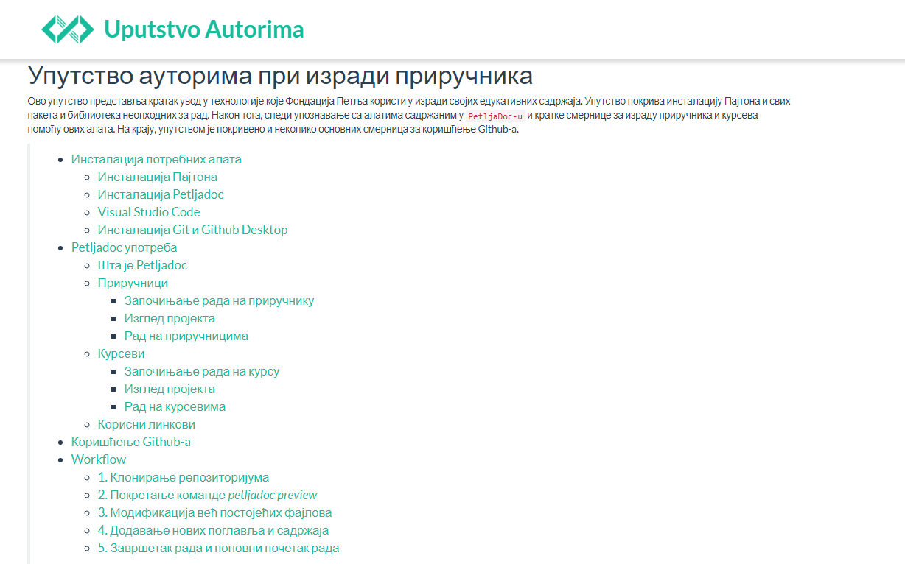

Ако желите да додате нови фајл, у коме ћете, на пример, направити нову лекцију, потребно је да у фолдер ``_sources`` додате нови ``.rst`` фајл и да поново покренете ``petljadoc preview`` (или, ако вам је отворен командни прозор у коме сте раније покренули ову команду, само запамтите неки од фајлова поново и Петљадок ће сам ажурирати садржај који се приказује у браузеру). Такође, важно је да у том тренутку свој нови фајл улинкујете у садржај, пошто ћете у супротном добити поруку о грешци. 

За инструкције како модификујете саме фајлове, како да укључујете поједине елементе и међусобно повезујете фајлове, погледајте наш `Демо курс <https://petlja.github.io/demo_kurs/02_basics/01_formatting.html#id5>`_. Такође, можете користити и `овај пројекат <https://github.com/Petlja/Primer_Prirucnik/archive/master.zip>`__ као мустру која вам може помоћи у раду.   

Курсеви
:::::::

Примере за курсеве можете наћи на `овој страници <https://petlja.org/net.kabinet>`__.

Започињање рада на курсу
------------------------

.. infonote:: **Започет пројекат на Гитхабу**
      
   Врло је вероватно да ће курс на коме је потребно да радите за вас већ бити започет и да ће бити довољно само да га преузмете са репозиторијума на Гитхабу. Ако је то случај, `овде <https://petlja.github.io/Uputstvo_Autorima/github.html>`__ можете видети како да преузмете одговарајући пројекат са Гитхаба. Након тога, слободно прескочите овај одељак и идите на следећи поднаслов, изглед пројекта.

Да бисте почели са радом на новом курсу помоћу Петљадока потребно је да прво отворите нови фолдер где ће се курс налазити. Затим је потребно да се у командној линији позиционирате у тај фолдер, што ћете најлакше урадити ако у Windows прозору тог фолдера у *search bar* укуцате ``cmd`` и притиснете ентер. 

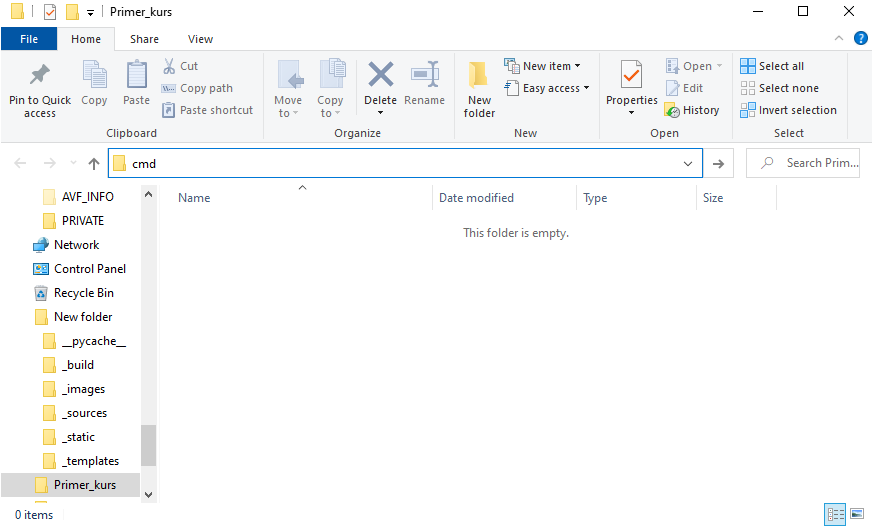

То ће отворити командни прозор у коме је потребно покренути команду ``petljadoc init-course`` која ће направити костур пројекта у изабраном фолдеру. 

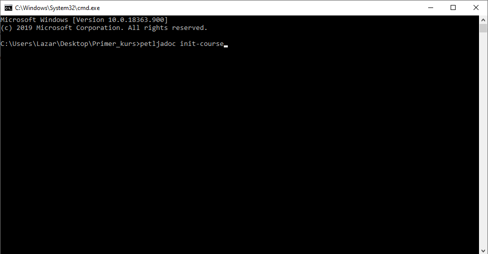

Када покренете ову команду потребно је да подесите још неколико параметара. Можете оставити предложене вредности (у угластим заградама) тако што ћете за сваки параметар притиснути ентер без уписивања било чега. Алтернативно, можете самостално подесити вредности ових параметара. На прво питање одговорите са ``y`` како бисте наставили даље. Потребно је да онда дате име пројекту, напишете име аутора, дате наслов који ће се појављивати у пројекту, изабрати програмски језик за примере кода који ће се извршавати у браузеру и на крају одабрати HTML тему целог пројекта (овде свакако оставите предложену вредност).

Изглед пројекта 
---------------

Пошто на свом рачунару имате започету верзију пројекта, фолдер пројекта требало би да вам изгледа као на слици испод: 

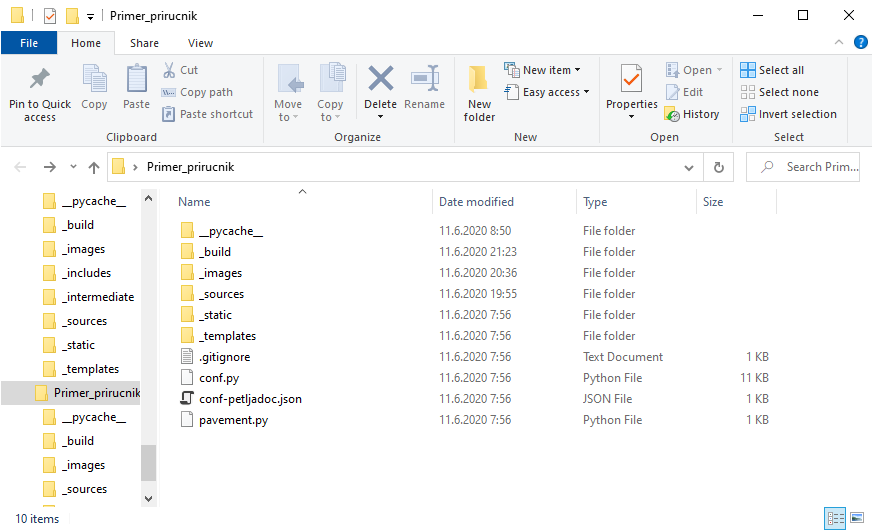

У основном директоријуму налази се неколико конфигурационих фајлова (``conf.py``, ``pavement.py``, ``conf-petljadoc.json``, ``.gitignore``) које у већини случајева није потребно мењати, а служе подешавању одређених параметара пројекта. Поред ових фајлова налази се и фолдер ``_templates`` који садржи елементе који ће контролисати изглед .HTML фајлова (ни садржај овог фолдера углавном није потребно мењати).

У фолдеру ``_sources`` налази се ``index.yaml`` фајл (о њему ће бити речи касније) као и фолдери у којима су смештени изворни ``.rst`` фајлови, у којима се заправо пише садржај пројекта у ``restructuredText`` формату.

На крају, фолдер ``_images`` служи смештању слика које ће бити коришћене у оквиру материјала, а фолдер ``_includes`` служи смештању различитих типова фајлова које је потребно укључити у курс (.pdf, .py i sl.)

Рад на курсевима
----------------

Да бисте видели како ће се у браузеру приказати оно што пишете у ``.rst`` фајловима, потребно је да отворите командни прозор и да се позиционирате у фолдер пројекта - ово ћете најлакше урадити тако што ћете у Windows прозору тог фолдера у *search bar* укуцати ``cmd`` и притиснути ентер.

Након тога, унесите команду `petljadoc preview` и притисните ентер.

Након неколико секунди, ово ће од ваших изворних фајлова направити .HTML фајлове који ће се налазити у новонасталом ``_build`` фолдеру. Такође ово ће отворити браузер прозор са вашим курсем. Ако је све протекло како треба, ваш командни прозор требало би овако да изгледа 

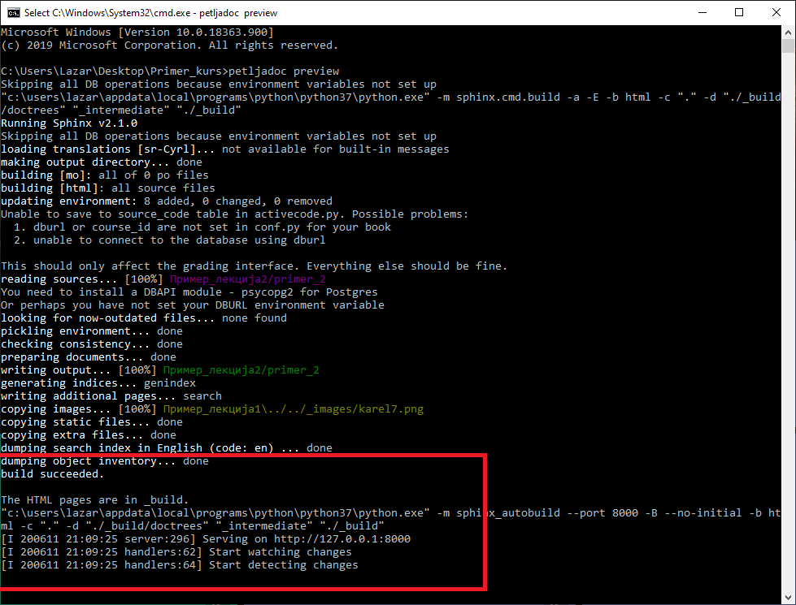

У прозору ће писати ``build succeeded`` и испод тога ће писати да се садржај сервира на локалном серверу на одређеној адреси (у нашем примеру то је ``http://127.0.0.1:8000``) и да је отворен браузер са том адресом. Истовремено, у браузеру ће садржај бити доступан управо на овој адреси. 

Након тога отвориће се у браузеру почетна страна курса која ће изгледати овако

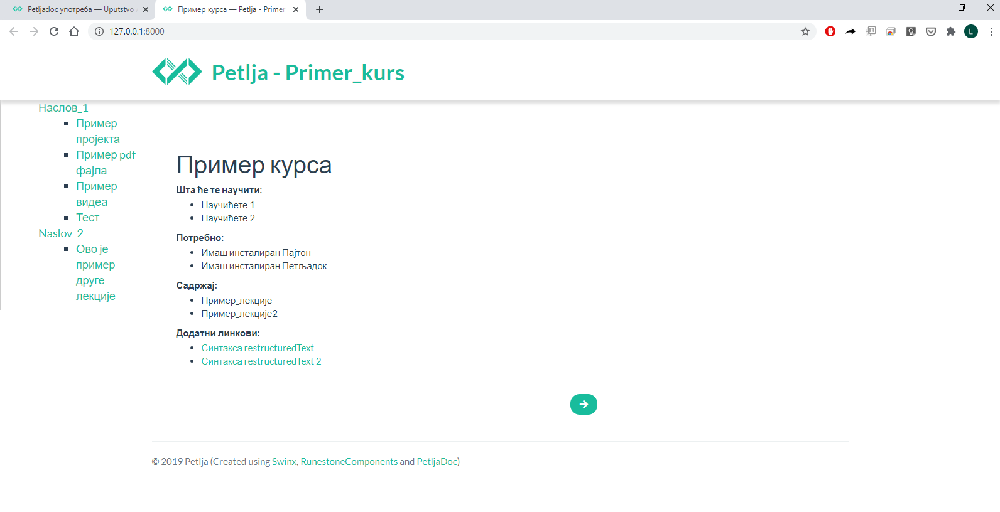

**Овај командни прозор оставите отворен све време док будете радили на курсу.** Ово је важно зато што на овај начин можете пратити промене које уносите у изворне ``.rst`` фајлове одмах након што их запамтите. Дакле, када у изворни фајл унесете неке промене и запамтите их, након неколико секунди, у браузеру ћете моћи да видите како те промене изгледају у .HTML фајловима (докле год ради командни прозор у коме је покренута команда ``petljadoc preview``). Препоручујемо да .rst фајлове отварате помоћу едитора Visual Studio Code тако што ћете у фолдеру пројекта кликнути на десни клик и изабрати опцију ``open with code``. 

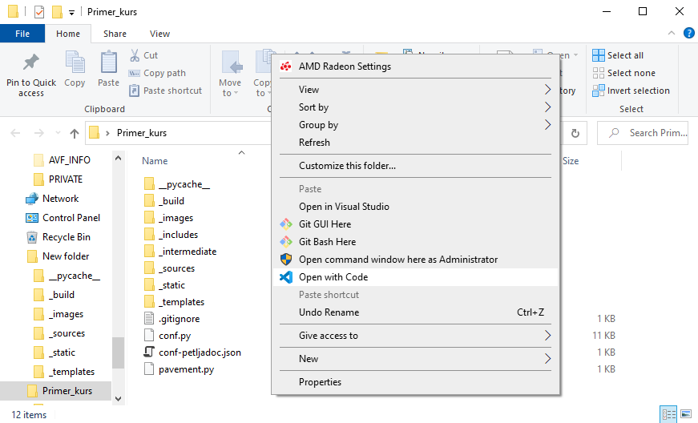

Ово ће отворити нови Visual Studio Code прозор у коме ћете са леве стране моћи да видите све фајлове и фолдере који се налазе унутар фолдера са пројектом, а, када одаберете жељени фајл, у средини ће бити садржај тог фајла. 

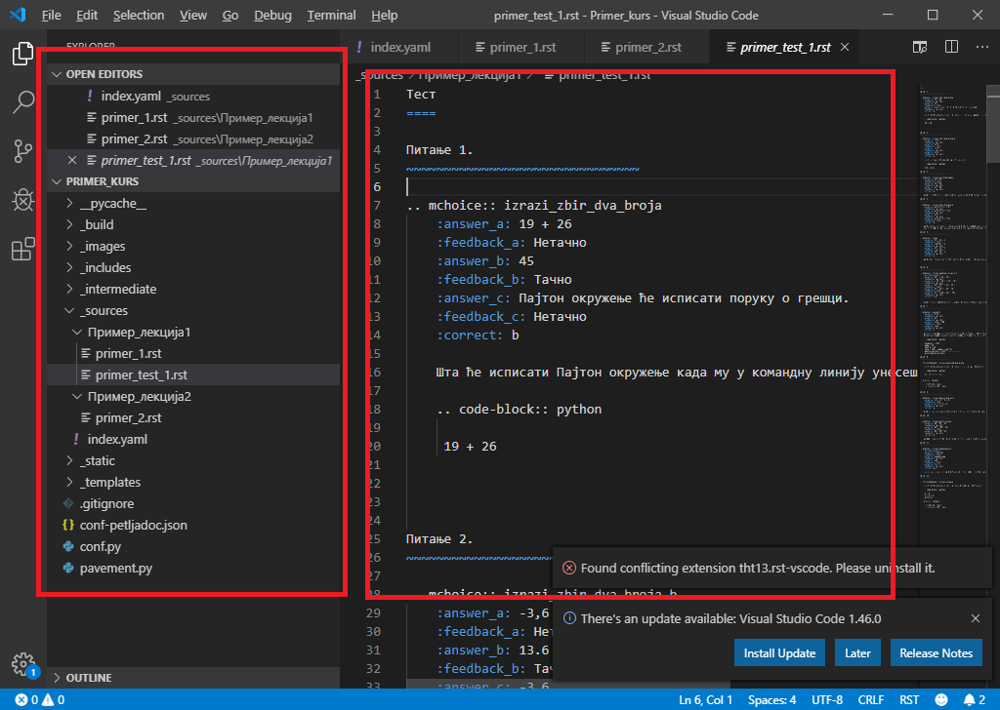

|

Модификовање .rst фајлова
+++++++++++++++++++++++++

|

Већина вашег рада свешће се на писање текста у restructuredText формату у .rst фајловима који се налазе у фолдеру _sources. Покушајте да промените неку реч у оквиру неког од .rst фајлова који се налазе у субфолдерима _sources фолдера и да запамтите ту промену (CTRL + S у Visual Studio Code). У позадини је, наравно, неопходно да постоји покренут командни прозор у коме је извршена команда `petljadoc preview`. Видећете како се у браузеру у реалном времену мења оно што сте написали. 

Препоручујемо да пре него што наставите са радом погледате овај курс https://petlja.github.io/demo_kurs/.
На овој страници можете пронаћи низ корисних савета и примера који ће вам помоћи да боље разумете како да форматирате своје restructuredText фајл и како у њега укључите елементе које желите. Такође, препоручујемо да `овај пројекат <https://github.com/Petlja/Primer_Kurs/archive/master.zip>`__ користите као мустру ако будете имали проблема са форматирањем фајлова или укључивањем фајлова у пројекат. 

Ако вам затреба нешто што се не налази у демо курсу, а потребно вам је за рад, погелдајте овај `линк <https://www.sphinx-doc.org/en/master/usage/restructuredtext/index.html>`__. Овде можете наћи и `синтаксни подсетник (cheatsheet) <https://docutils.sourceforge.io/docs/user/rst/quickref.html>`__ који вам може бити користан приликом рада. 

Слободно се враћајте на линкове из овог поглавља и користите их као подсетник током целог процеса писања материјала. 

Међутим, поред модификације већ постојећих .rst фајлова, биће потребно да додајете и нове активности и за то ће бити неопходно да ажурирате .yaml фајл. 

|

Форматирање .yaml фајла
+++++++++++++++++++++++

|

**Јако је важно** да током рада на курсу правилно ажурирате (попуњавате и форматирате) ``index.yaml`` фајл. У овом фајлу налазе се сви релеватни подаци које Петљадок користи да би од изворних фајлова направио .html фајлове. Све нове лекције и садржаје које желите да укључите у свој пројекат морате, са једне стране убацити на одговарајуће место у структури пројекта (у одговарајућ фолдер), а са друге стране морате их на одговарајући начин укључити у ``index.yaml`` фајл.

Ово подразумева да **ОБАВЕЗНО** поштујете структуру назубљивања каква постоји у овом фајлу, Такође, јако је важно да се у подацима који се наводе у ``index.yaml`` поклапају са стањем у остатку пројекта. Када отворите ``index.yaml`` он ће изгледати као на слици испод. 

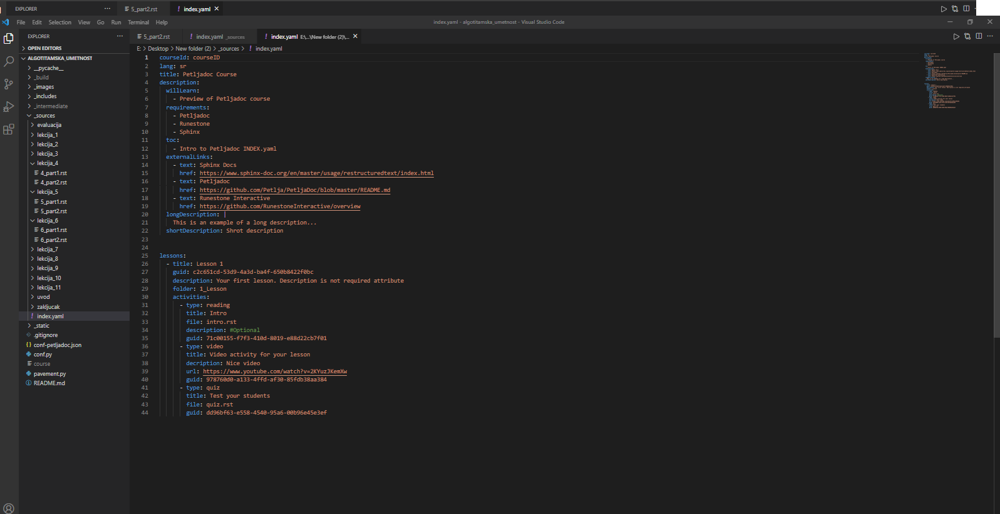

Сада ћемо проћи кроз главне делове овог фајла и објаснити на шта је најважније обратити пажњу. 

|

Део index.yaml фајла са информацијама о курсу
+++++++++++++++++++++++++++++++++++++++++++++

|

Први део ``index.yaml`` фајла представља опште податке о курсу који ће се наћи на насловној страни курса када покренете ``petljadoc preview``. Ово је потребно попунити подацима о курсу и **јако је важно да назубљивање остане са истом структуром** као што је представљено у следећем примеру. 

.. code-block:: yaml

    courseId: Test_primer #Jako je važno da ovaj ID bude jedinstven za svaki kurs
    lang: sr-Cyrl # Ovde se definiše jezik projekta 
    title: Пример Петљадок курса
    description:
      willLearn: # листа у којој се наводи шта ће све ученик научити на овом курсу
        - Научићете 1 
        - Научићете 2
      requirements: # листа у којој се наводи шта је непходно пре него што се почне са овим курсом
        - Имаш инсталиран Пајтон
        - Имаш инсталиран Петљадок
      toc: #садржај курса који ће се приказати на насловној страни
        - Пример_лекције
        - Пример_лекције2
      externalLinks: # опционо - односи се на линкове које аутор препоручује ученицима да погледају пре курса
        - text: Синтакса restructuredText
          href: https://docutils.sourceforge.io/docs/user/rst/quickref.html
        - text: Синтакса restructuredText 2
          href: https://www.sphinx-doc.org/en/master/usage/restructuredtext/index.html
      longDescription: |
      Дужи опис целог курса који треба да буде параграф - коме је курс намењен, шта ће научити и сл. 
      shortDescription: Кратак опис пројекта 

На следећој слици приказано је како наведени елементи изгледају на примеру курса који је објављен на Петљи: 

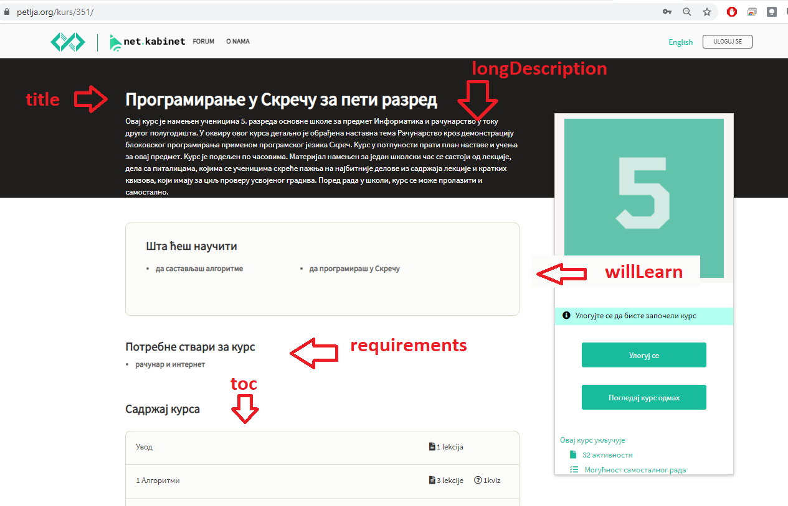

|

Део index.yaml фајла са информацијама о лекцијама
+++++++++++++++++++++++++++++++++++++++++++++++++

|

Други део ``index.yaml`` фајла односи се на лекције у којима је сав садржај курса. У њему је такође јако важно одржати исту структуру назубљивања, али мора се обратити пажња и на имена фајлова и фолдера као и на ``guid-e`` елемената.  Овај део фајла почиње линијом у којој се налази ``lessons:`` и која је поравната са левом ивицом екрана (погледајте код испод или отворите ``index.yaml`` у свом пројекту). 

Први ниво хијерархије у оквиру курса представљају лекције, а други ниво хијерархије представљају активности у оквиру лекција. Ако погледамо следећи пример видећемо да се ради о курсу који има 2 лекције и да у свакој од њих постоји по једна активност. 

.. code-block:: yaml

    lessons:
      - title: Лекција_1
        folder: Пример_лекција1
        guid: c2c651cd-53d9-4a3d-ba4f-650b8422f0bc
        description: Прва лекција
        activities:
        - type: reeding
            title: Активност_1
            file: primer_1.rst 
            description: #opciono
            guid: 71c00155-f7f3-410d-8019-e88d22cb7f01
      - title: Lekcija_2
        folder: Пример_лекција2
        guid: c79a8591-ad06-4e46-9d4d-8ecb5361cf8c
        description:  Друга лекција
        activities:
        - type: reeding
            title: Aktivnost_2
            file: primer_2.rst 
            description: #opciono
            guid: 4576c9a4-2071-4a21-b221-a646477e05be

Овај пример .yaml фајла одговара следећој слици:

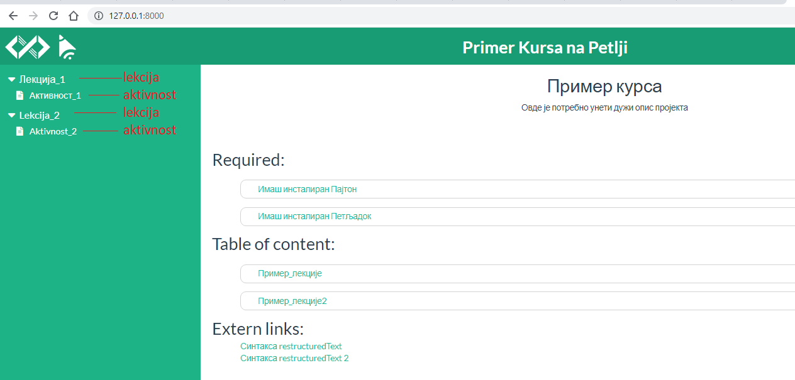

У садржају се види да су у првом нивоу хијерархије приказане лекције, а у другом нивоу активности у оквиру тих лекција. 

Свака лекција почиње редом у коме се налази ``- title:`` и који је са два спејса увучен у односу на почетни ред овог дела фајла у коме се налази ``lessons:``. Поред ознаке ``- title:`` потребно је написати назив лекције. У нашем примеру ставили смо као наслов прве лекције **Лекција_1**, а као наслов друге лекције **Lekcija_2**. Обратите пажњу да је наслове могуће навести и ћирилицом и латиницом и стрингови које овде наведете као називе лекција приказаће се у садржају курса са леве стране. 

После наслова долази поље ``- folder:`` у које се уноси назив фолдера у који су смештени фајлови лекције унутар ``_sources`` фолдера. Он се **МОРА ПОКЛАПАТИ** са називом фолдера лекције (ћирилица, латиница, велика слова, знаци интерпункције...) На нашем примеру то су фолдери ``Пример_лекција1`` и ``Пример_лекција2``. Назив фолдера се може разликовати од наслова лекције. 

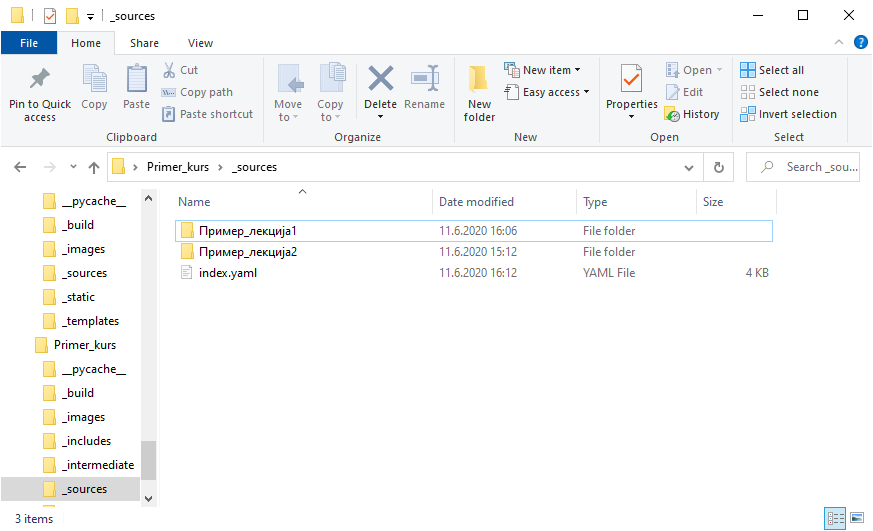

Затим следи ``guid`` лекције. Он је обавезан и представља јединствени идентификатор за сваки елемент курса. Њега можете добити тако што ћете га генерисати `овде <https://www.guidgenerator.com/online-guid-generator.aspx>`__ или тако што ћете приснути F1 у Visual Studio Code-у и ту изабрати опцију ``insert guid`` која ће вам бити видљива ако сте инсталирали екстензију коју смо навели у поглављу *Инсталација потребних алата*. Исти ``guid`` не смете да користите више од једном иначе ћете добити грешку приликом покретања команде ``petljadoc preview``. 

Следеће поље представља опис лекције и оно је опционо. Поља ``title``, ``guid``, ``description`` и ``activities`` морају бити поравната. Када желите да пређете на следећу лекцију, пазите на поравнање и на то да сваки елемент мора имати јединствен ``guid``. Важно је да свака нова лекција буде поравната са претходним лекцијама.  

|

Типови активности 
+++++++++++++++++

|

У оквиру лекција налазе се активности. Све активности морају бити увучене на начин на који је приказано у коду испод. Активности могу имати три типа ``reeding``, ``video`` и ``quiz``. Ако се ради о активности у којој се од ученика очекује да прочита неки текст (интерактиван или "обичан"), тип активности треба означити као ``reeding``, у активности типа ``video``, читалац ће видети само видео плејер у коме ће бити смештен жељени видео и у активности типа ``quiz``, од читаоца се очекује да одговори на питања. Све активности у оквиру једне лекције морају бити поравнате и свака има слична поља која треба попунити. У лекцији нема ограничења на број активности.

.. code-block:: yaml

    lessons:
      - title: Лекција_1
        folder: Пример_лекција1
        guid: c2c651cd-53d9-4a3d-ba4f-650b8422f0bc
        description: Прва лекција
        activities:
        - type: reeding
            title: Пример фајла
            file: primer_1.rst 
            description: #opciono
            guid: 71c00155-f7f3-410d-8019-e88d22cb7f01
        - type: reeding
            title: Пример pdf фајла
            file: primer_dokument.pdf
            description: ...
            guid: d90350ae-84e4-4e49-bac8-2d4849e3c409
        - type: video
            title: Пример видеа
            url: https://www.youtube.com/watch?v=flu3-ntQIlE # može da se navede i ceo YT url, a može i samo ID (id u bilo kom yt linku predstavlja 11 karatkera nakon v=)
            description: ...
            guid: 61657689-aa6b-46c9-87da-51869d6477ee
        - type: quiz 
            title: Пример теста
            file: primer_test_1.rst
            description: ...
            guid: a725f29a-b323-4a1a-b52d-6eae141bc243

У овом примеру видимо један пројекат у коме се у првој лекцији налазе 4 активности различитих типова. Поље ``- type`` увек је поравнато са ``activities:`` док су сва поља унутар једне активнсти увучена са четири спејса. 

Горе наведени пројекат у браузеру изгледа овако:

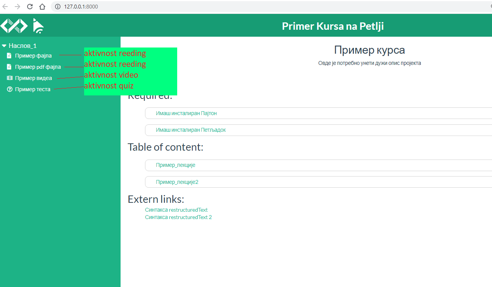

Активност reeding 
+++++++++++++++++

Код активности овог типа прво наводимо наслов активности у пољу ``title:`` који ће се приказати у садржају. Tо може бити било који стринг. 

У следећем пољу, ``file:`` наводимо фајл који представља изворни фајл ове активности. То може бити .rst фајл који се налази у фолдеру лекције (субфолдер унутар фолдера ``_sources``.) или .pdf фајл који треба да се налази унутар фолдера ``_static`` (у фолдеру пројекта). Име фајла овде мора **дословно** да се наведе (обратите пажњу на писмо, величину слова и на екстензију фајла). 

Након тога следи опис активности који је опцион и након тога следи ``guid`` (потребно је поново генерисати нови, јединствени ``guid`` за сваку активност). 

Ако смо активност овог типа укључили из .rst фајла, наш крајњи резултат у браузеру ће се приказати овако:

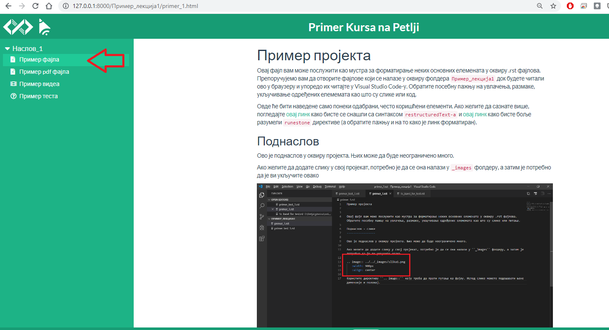

Док ће се активност овог типа коју смо укључили из .pdf фајла приказати овако:

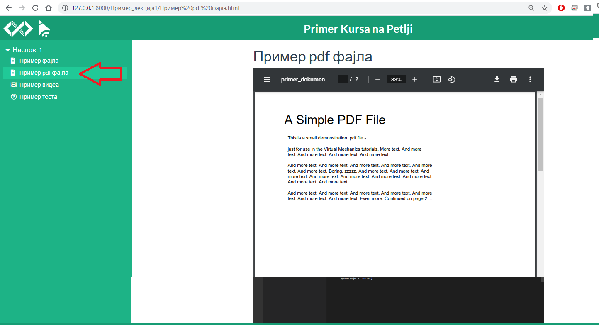

Активност video
+++++++++++++++

Ако је активност типа ``video``, поља која користимо су слична. И код активности овог типа прво наводимо наслов активности у пољу ``title:`` који ће се приказати у садржају. Tо може бити било који стринг. 

Следеће је поље ``url:`` у које је потребно унети цео урл видеа на Youtube или само Id видеа, који представља 11 карактера након секвенце **v=**.

Након тога следи опис активности који је опцион и након тога следи ``guid`` (потребно је поново генерисати нови, јединствени ``guid`` за сваку активност). 

.. infonote:: Укључивање видеа 

   Обратите пажњу да ако видео у свој пројекат укључите на овај начин, цела једна активност биће видео који сте навели. Ако желите да у оквиру текста (у оквиру активности ``reeding``) укључите видео, то можете урадити користећи директиву ``.. ytpopup::``. Више о томе можете видеи `на следећем линку <https://petlja.github.io/demo_kurs/02_basics/02_directives.html#ytpopup>`_.

Активност quiz
++++++++++++++

Као и код осталих типова активности, и код активности типа ``quiz`` наводимо у првом пољу наслов активности, а затим у пољу ``file`` наводимо име .rst фајла у коме се налазе питања за квиз. Овај фајл је смештен у фолдер лекције у оквиру ``_sources`` фолдера. 

Након тога следи опис активности који је опцион и након тога следи ``guid`` (потребно је поново генерисати нови, јединствени ``guid`` за сваку активност). 

Да бисте видели како треба да изгледа .rst фајл који садржи квиз и које све типове питања можете искористити у својим квизовима, погледајте `ово поглавље <https://petlja.github.io/demo_kurs/02_basics/02_directives.html#id22>`_ нашег демо курса. 

|

Архивирање лекција и активности - како избрисати активност/лекцију из пројекта
+++++++++++++++++++++++++++++++++++++++++++++++++++++++++++++++++++++++++++++++

|

Ако у оквиру вашег курса постоје неке активности или лекције које су некада објављене на Петљи, али су током рада на курсу и ажурирања објављене верзије курса уклоњене, **ОБАВЕЗНО ЈЕ** њихове гуиде ставити у поље архивираних лекција или поље архивираних активности. 

Ако се ради о лекцијама које желимо да архивирамо, поље архивираних лекција, ``archived-lessons:``, смешта се на крај .yaml фајл поравнато са пољем ``lessons:``. Након тога се увучено наводе гуиди свих архивираних лекција.

Ако се ради о активностима унутар лекија, на крају сваке лекције треба навести поље архивираних активности, ``archived-activities:`` које је потребно поравнати са насловом лекције. У оквиру тог поља, увучено, треба навести гуиде свих активности које желимо да архивирамо.

Погледајте како је то урађено на следећем примеру: 

.. code-block:: yaml

    lessons:
      - title: Лекција_1
        folder: Пример_лекција1
        guid: c2c651cd-53d9-4a3d-ba4f-650b8422f0bc
        description: Прва лекција
        activities:
        - type: reeding
            title: Пример фајла
            file: primer_1.rst 
            description: #opciono
            guid: 71c00155-f7f3-410d-8019-e88d22cb7f01
        archived-activities: 
          - guid: de4d8ced-7457-4257-a156-250bdb711d65
          - guid: 22752682-f23f-4df7-b590-e22780fda0a3
    archived-lessons:
      - guid: 3ced8ac6-8be7-4921-bea7-dccf89a7cc79
      - guid: 29a3a23a-0cdb-4a2b-ad6b-611d36c39db5

У овом примеру видимо један курс у коме постоји једна лекција са једном активношћу, али и 2 архивиране активности у оквиру те лекције као и две архивиране лекције у оквиру курса. 

|

Пример комплетног .yaml фајла
+++++++++++++++++++++++++++++++++++++++++++++++++++++++++++++++++++++++++++++++

|

Овако би изгледао један комплетан .yaml фајл курса са спојеним првим и другим делом фајла, који се тичу информација о курсу и лекцијама, и који у себи садржи две лекције са разлиитим типовима активости као и архивиране лекције и активности

.. code-block:: yaml

   courseId: kurs-primer
   lang: sr-Cyrl
   title: Пример курса
   description:
   willLearn: # list
     - Научићете 1
     - Научићете 2
   requirements:
     - Имаш инсталиран Пајтон
     - Имаш инсталиран Петљадок
   toc:
     - Пример_лекције
     - Пример_лекције2
   externalLinks: # opciono 
     - text: Синтакса restructuredText
       href: https://docutils.sourceforge.io/docs/user/rst/quickref.html
     - text: Синтакса restructuredText 2
       href: https://www.sphinx-doc.org/en/master/usage/restructuredtext/index.html
   longDescription:
     Овде је потребно унети дужи опис пројекта
   shortDescription: 
     Овде можете унети краћи опис пројекта

   lessons:
     - title: Наслов_1
       folder: Пример_лекција1
       guid: c2c651cd-53d9-4a3d-ba4f-650b8422f0bc
       description: Прва лекција
       activities:
         - type: reading
           title: Пример фајла
           file: primer_1.rst
           description: #opciono
           guid: 71c00155-f7f3-410d-8019-e88d22cb7f01
         - type: reading
           title: Пример pdf фајла
           file: primer_dokument.pdf
           description: ...
           guid: d90350ae-84e4-4e49-bac8-2d4849e3c409
         - type: video
           title: Пример видеа
           url: https://www.youtube.com/watch?v=flu3-ntQIlE
           guid: 61657689-aa6b-46c9-87da-51869d6477ee
         - type: quiz 
           title: Пример теста
           file: primer_test_1.rst
           description: ...
           guid: a725f29a-b323-4a1a-b52d-6eae141bc243
       archived-activities: 
         - guid: de4d8ced-7457-4257-a156-250bdb711d65
         - guid: 22752682-f23f-4df7-b590-e22780fda0a3
     - title: Naslov_2
       folder: Пример_лекција2
       guid: c79a8591-ad06-4e46-9d4d-8ecb5361cf8c
       description:  Друга лекција
       activities:
         - type: reading
           title: Primer rst fajla
           file: primer_2.rst
           description: #opciono
           guid: 4576c9a4-2071-4a21-b221-a646477e05be   
   archived-lessons: 
     - guid: 3ced8ac6-8be7-4921-bea7-dccf89a7cc79
     - guid: 29a3a23a-0cdb-4a2b-ad6b-611d36c39db5

.. infonote:: **Савет**

   Као што сте видели до сад, важно је да алтернирате између Visual Studio Code-a у коме ћете гледати изворне фајлове и браузера у коме ћете видети приказ онога што правите у изворним фајловима.

   Такође, важно је да када год додајете нешто ново од изворних фајлова, то на одговарајући начин назначите у .yaml фајлу како би Петљадок знао шта да прикаже у браузеру.

.. infonote:: **Подсетник и смернице:** 
            
            - Изворни фајлови (.rst) налазе се унутар потфолдера унуар фолдера ``_sources``
            - Ако желите да укључите .pdf фајл, сместие га у ``_static`` фолдер
            - Ако желите да укључите слике, сместите их у ``_images`` фолдер
            - Ако желите да укључите фајл са кодом, сместите га у нови фолдер ``_scripts``
            - **ОБАВЕЗНО** обратите пажњу на структуру ``index.yaml`` фајла
            - Обавезно обратите пажњу на имена фајлова и фолдера када их наводите у ``index.yaml`` фајлу
            - Сваки елемент ``index.yaml`` фајла мора да има свој јединствени ``guid``
            - Свака нова лекција и активност коју желите да укључите у курс морају бити наведене у ``index.yaml`` фајлу.
            - Ако неки елемент који је објављен на Петљи приликом поновног објављивања курса желите да уклоните, ставите његов гуид у архивиране елементе (ако је цела лекција у архивиране лекције, ако је активност у оквиру неке лекције, у архивиране активности)
            - Ослоните се на мустре које смо вам припремили како бисте видели како да најлакше форматирате свој пројекат.   

Грешке
::::::

Приликом рада, често ће се десити да негде погрешите, било да се ради о погрешном форматирању .yaml фајла приликом рада са курсевима, било да се ради о синтаксној грешци приликом писања reStructuredText кода, било да се ради о укључивању фајла који не постоји... Кад год се деси нешто што Петљадок препознаје као грешку, у оквиру командног прозора у коме сте покренули ``petljadoc preview`` команду, црвеним словима исписаће се порука о грешци и та порука изгледаће као на следећој слици:

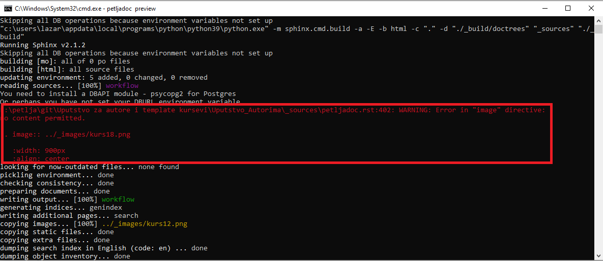

У оквиру те поруке, која год да је грешка направљена, писаће у ком фајлу је грешка настала и на којој линији кода у оквиру тог фајла се грешка појавила. Такође, у оквиру поруке биће назначено и шта није у реду са кодом, то јест због чега Петљадок није успео да на одговарајућ начин избилдује ваш пројекат. У овом конкретном случају, видимо да у фајлу ``petladoc.rst`` који се налази унутар фолдера ``_sources`` у оквиру нашег пројекта, на линији 402 на погрешан начин форматирана директива за укључивање слике. 

Такође, када бисмо погледали како у браузеру изгледа фајл који је избилдован уз грешку, видећемо да се на месту где треба да се појави слика такође појављује иста порука о грешци

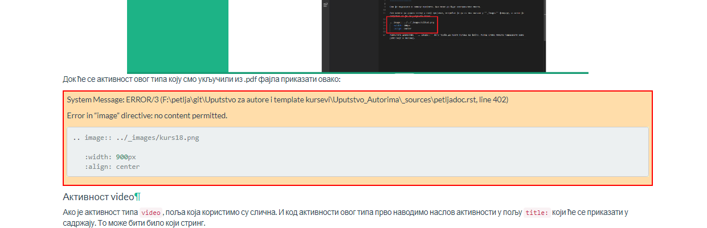

У овом примеру проблем је у томе што имамо празан ред вишка између реда у коме се налази директива ``.. image::`` и њених опција ``:width:`` и ``:align:``. Грешку отклањамо брисањем тог реда и наш материјал ће се, након што запамтимо промене, у браузеру приказати без упозорења о грешци. 

.. infonote:: Важно

   Ако током рада приметите да се у браузеру приказују грешке на одређеним местима у материјалу на коме радите, **НЕМОЈТЕ ИХ ИГНОРИСАТИ** већ покушајте да их исправите или контактирајте неког из тима Петље да вам помогне у исправљању грешака. **ВАШ МАТЕРИЈАЛ НЕЋЕ МОЋИ ДА СЕ ОБЈАВИ АКО ИМА БИЛО КАКВИХ УПОЗОРЕЊА О ГРЕШКАМА**

Корисни линкови
:::::::::::::::

* Демо курс као помоћ за форматирање фајлова - https://petlja.github.io/demo_kurs/
* Поглавље `restructuredText <https://www.sphinx-doc.org/en/master/usage/restructuredtext/index.html>`__ из документације Sphinx-а 
* `Runestone Author’s Guide <https://runestone.academy/runestone/static/authorguide/index.html>`__
* `PetljaDoc README <https://github.com/Petlja/PetljaDoc/blob/master/README.md>`__ 
* Приручник Текстуално програмирање у Пајтону, урађен у Петљадоку `source code <https://github.com/Petlja/TxtProgInPythonSrLat>`__ and 
  `public preview <https://petlja.github.io/TxtProgInPythonSrLat/>`__
* Мустра за курс коју можете користити приликом рада https://github.com/Petlja/Primer_Kurs/archive/master.zip