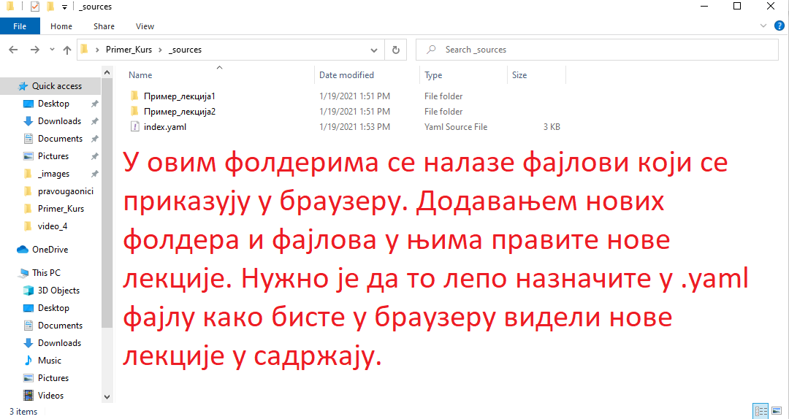
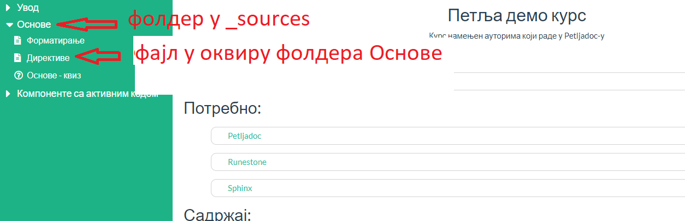

Workflow
========

Овде ћемо у корацима описати како изгледа уобичајен рад са Петљадоком на неком курсу. Ако се заглавите на било ком од ових корака, препоручујемо да упоредите свој пројекат са `ОВИМ ПРОЈЕКТОМ <https://github.com/Petlja/Primer_Kurs/archive/master.zip>`__ који можете користити као мустру за форматирање. 

1. Клонирање репозиторијума
---------------------------

Први корак пре почетка рада је да клонирате репо који је за вас направљен на Гитхабу. Линк ка репозиторијуму добићете од тима Фондације Петља. Ако још увек нисте видели како то да урадите погледајте `овде <https://petlja.github.io/Uputstvo_Autorima/github.html>`__

2. Покретање команде `petljadoc preview` 
----------------------------------------

Када сте клонирали пројекат, други корак је да у фолдеру пројекта отворите командни прозор и покренете команду `petljadoc preview` што ће ваш пројекат приказати у браузеру. Овај корак погледајте у делу упутства https://petlja.github.io/Uputstvo_Autorima/petljadoc.html#id9. Оставите командни прозор отвореним током рада на курсу. 

3. Модификација већ постојећих фајлова 
--------------------------------------

Када сте покренули пројекат, у оквиру потфлодера унутар фолдера _sources налазе се .rst фајлови у којима се налази текст и главни други садржаји пројекта. Да бисте видели како да их форматирате погледајте материјале из овог поглавља https://petlja.github.io/Uputstvo_Autorima/petljadoc.html#rst. Кад год нешто промените у изворним фајловима, не заборавите да запамтите промене (CTRL+S) и то ће промене ажурирати у прозору прегледача који приказује курс који правите. 

4. Додавање нових поглавља и садржаја
-------------------------------------

Ако желите да додате ново поглавље, у оквиру фолдера _sources направите нови потфолдер који ће представљати лекцију у курсу и затим у њега додајте нове .rst фајлове који ће представљати појединачне активности у оквиру те лекције. Када то урадите, ажурирајте .yaml фајл на начин на који је то објашњено у овом поглављу https://petlja.github.io/Uputstvo_Autorima/petljadoc.html#yaml. Када форматирате овај фајл како је речено, запамтите промене и требало би да се ваше ново поглавље прикаже у браузеру (докле год у позадини ради командни прозор из корака 2.) 

Дакле, као што је већ речено, фајлови у којима ћете писати текст курса налазе се у фолдеру `_sources`. У њему се налазе потфолдери који представљају лекције, а унутар тих потфолдера налазе се .rst фајлови који представљају активности унутар тих лекција. Обавезно ажурирајте index.yaml сваки пут када уводите неки нови елемент у свој курс.

У истом поглављу је објашњено и како да додате садржаје који нису текстуалног типа (квизове, .pdf фајлове, видео...)

5. Завршетак рада и поновни почетак рада
----------------------------------------

Када сте завршили са радом, можете искључити командни прозор.

На крају, обавезно промене које сте направили пошаљите на Гитхаб репозиторијум. То такође можете видети овде `овде <https://petlja.github.io/Uputstvo_Autorima/github.html>`__

Када следећи пут почнете са радом, не заборавите да повучете евентуалне промене са репозиторијума (такође објашњено на претходном линку). Поново покрените командни прозор (корак 2) и наставите даље по корацима као и раније.

Како је Петљадок алат који се стално развија, не заборавите да редовно унапређујете верзију коју имате на свом рачунару. То можете урадити тако што ћете отворити командни прозор и покренути команду ``pip install petljadoc --upgrade``, што ће инсталирати нову верзију Петљадока. Ово можете урадити сваки пут када почнете са радом - ако је ваша верзија ажурна ништа се неће десити.  

Ако будете имали било каквих проблема, слободно пишите на lazar.bojicic@petlja.org 

